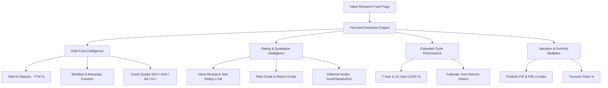

# 🚀 Value Research Integration via Firecrawl: Complete Architecture & Implementation Guide

This document outlines the end-to-end design, architecture, schemas, and implementation roadmap for integrating **Firecrawl** to extract advanced fund intelligence (Debt YTM, Duration, Credit Ratings, Star Ratings, 7Y/10Y cycles) from **Value Research Online (VRO)** into our Next.js / PostgreSQL portfolio engine.

---

## 1. Executive Summary & Why Firecrawl?

### The Challenge with Value Research Online:
* **Cloudflare Bot Management**: Standard HTTP scrapers (`axios`, `node-crawler`, `scrapy`, `urllib`) return `HTTP 403 Forbidden` or CAPTCHA challenges.
* **Heavy Dynamic DOM**: Tables (DataTables) and interactive tabs require JavaScript execution and DOM hydration.
* **Complex HTML Structures**: CSS classes and layout wrappers change frequently, breaking traditional CSS selector scrapers.

### The Firecrawl Advantage:
1. **Automated Anti-Bot Bypass**: Natively navigates Cloudflare WAF, proxy rotation, and browser fingerprints without custom reverse engineering.
2. **Schema-Driven JSON Extraction**: Uses LLM-powered extraction with **Zod / JSON Schema** — you specify the exact TypeScript fields you want (`ytm`, `modifiedDuration`, `starRating`), and Firecrawl returns structured JSON directly.
3. **No Fragile Selector Maintenance**: Eliminates broken XPath/CSS selectors when VRO updates its UI design.
4. **Clean TypeScript SDK**: Native support in Node.js via `@mendable/firecrawl-js`.

---

## 2. Target Data Points to Extract from Value Research



---

## 3. Database Schema Extensions

To store the enriched Value Research metrics permanently in PostgreSQL (avoiding repetitive scraping and saving Firecrawl API credits), update `src/db/schema.ts`:

```typescript
// Add to schemeCategoryRankings or create a dedicated vroFundMetrics table
export const vroFundMetrics = mySchema.table(
  "vro_fund_metrics",
  {
    id: serial("id").primaryKey(),
    schemeCode: text("scheme_code").notNull().unique(), // AMFI Scheme Code
    vroFundId: text("vro_fund_id"),                     // VRO internal ID (e.g. "17404")
    vroUrl: text("vro_url"),
    
    // Star Rating & Opinion
    starRating: integer("star_rating"),                 // 1 to 5
    riskGrade: text("risk_grade"),                      // e.g. "Below Average"
    returnGrade: text("return_grade"),                  // e.g. "Above Average"
    vroOpinion: text("vro_opinion"),                    // "Good", "Steady", "Exit"
    
    // Specialized Debt Metrics
    ytm: doublePrecision("ytm"),                         // Yield to Maturity % (e.g. 7.42)
    modifiedDuration: doublePrecision("modified_duration"), // In years (e.g. 0.45)
    macaulayDuration: doublePrecision("macaulay_duration"), // In years
    averageMaturity: text("average_maturity"),           // e.g. "5.4 Months"
    creditQualityData: text("credit_quality_data"),     // JSON string: { sov: 42.1, aaa: 38.5, a1Plus: 14.2, cash: 5.2 }
    
    // Multi-Cycle Long Term Returns
    return7Y: doublePrecision("return_7y"),
    return10Y: doublePrecision("return_10y"),
    returnSinceLaunch: doublePrecision("return_since_launch"),
    
    // Portfolio & Multiples
    portfolioPe: doublePrecision("portfolio_pe"),
    portfolioPb: doublePrecision("portfolio_pb"),
    turnoverRatio: doublePrecision("turnover_ratio"),
    
    // Metadata
    lastScrapedAt: timestamp("last_scraped_at").defaultNow().notNull(),
    createdAt: timestamp("created_at").defaultNow().notNull(),
    updatedAt: timestamp("updated_at")
      .defaultNow()
      .$onUpdate(() => new Date())
      .notNull(),
  },
  (table) => [index("vro_metrics_scheme_code_idx").on(table.schemeCode)]
);
```

---

## 4. TypeScript Types & Zod Schemas

Define the target extraction structure in `src/types/vro-fund.ts`:

```typescript
import { z } from "zod";

export const VroCreditQualitySchema = z.object({
  sov: z.number().nullable().optional().describe("Sovereign / Government bonds percentage"),
  aaa: z.number().nullable().optional().describe("AAA rated instruments percentage"),
  aaPlus: z.number().nullable().optional().describe("AA+ rated instruments percentage"),
  aa: z.number().nullable().optional().describe("AA rated instruments percentage"),
  a1Plus: z.number().nullable().optional().describe("A1+ commercial papers percentage"),
  belowAA: z.number().nullable().optional().describe("Below AA rated instruments percentage"),
  cashAndEquivalents: z.number().nullable().optional().describe("Cash & equivalents percentage"),
});

export const VroFundExtractionSchema = z.object({
  fundName: z.string().describe("Full mutual fund name"),
  category: z.string().describe("SEBI Mutual fund category name"),
  starRating: z.number().min(1).max(5).nullable().optional().describe("Value Research star rating from 1 to 5"),
  riskGrade: z.string().nullable().optional().describe("Value Research risk grade (e.g., Low, Below Average, Average, Above Average, High)"),
  returnGrade: z.string().nullable().optional().describe("Value Research return grade"),
  vroOpinion: z.string().nullable().optional().describe("Editorial verdict e.g. Good, Steady, Watchlist, Exit"),
  
  // Debt Specific Ratios
  ytm: z.number().nullable().optional().describe("Yield to Maturity percentage (YTM) for debt funds"),
  modifiedDuration: z.number().nullable().optional().describe("Modified duration in years (e.g. 0.42)"),
  macaulayDuration: z.number().nullable().optional().describe("Macaulay duration in years"),
  averageMaturity: z.string().nullable().optional().describe("Average maturity of debt portfolio (e.g. '5.2 Months' or '2.1 Years')"),
  creditRatings: VroCreditQualitySchema.nullable().optional().describe("Credit quality breakdown of debt instruments"),
  
  // Returns
  return1Y: z.number().nullable().optional(),
  return3Y: z.number().nullable().optional(),
  return5Y: z.number().nullable().optional(),
  return7Y: z.number().nullable().optional().describe("7-Year annualized return %"),
  return10Y: z.number().nullable().optional().describe("10-Year annualized return %"),
  returnSinceLaunch: z.number().nullable().optional().describe("Return since inception/launch %"),
  
  // Fund Info
  aumCr: z.number().nullable().optional().describe("Total AUM in Crores (₹)"),
  expenseRatio: z.number().nullable().optional().describe("Base Direct Plan Expense Ratio %"),
  turnoverRatio: z.number().nullable().optional().describe("Portfolio turnover ratio %"),
  fundManagers: z.array(z.string()).nullable().optional().describe("Names of current fund managers"),
});

export type VroFundExtractedData = z.infer<typeof VroFundExtractionSchema>;
```

---

## 5. Service Implementation: `src/lib/firecrawlService.ts`

```typescript
import FirecrawlApp from "@mendable/firecrawl-js";
import { VroFundExtractionSchema, type VroFundExtractedData } from "@/types/vro-fund";
import { db } from "@/db/db";
import { vroFundMetrics } from "@/db/schema";
import { eq } from "drizzle-orm";

const firecrawl = new FirecrawlApp({
  apiKey: process.env.FIRECRAWL_API_KEY || "",
});

/**
 * Scrapes and extracts institutional metrics from any Value Research fund URL using Firecrawl
 */
export async function extractVroFundMetrics(
  vroUrl: string,
  schemeCode: string
): Promise<VroFundExtractedData | null> {
  if (!process.env.FIRECRAWL_API_KEY) {
    console.error("[FirecrawlService] Missing FIRECRAWL_API_KEY in environment");
    return null;
  }

  try {
    console.log(`[FirecrawlService] Scraping VRO URL: ${vroUrl}`);
    
    const scrapeResponse = await firecrawl.scrapeUrl(vroUrl, {
      formats: ["extract"],
      extract: {
        schema: VroFundExtractionSchema,
        prompt: `Extract mutual fund risk statistics, debt metrics (YTM, duration, credit ratings), ratings (Star rating, risk grade, return grade), and long-term returns from this Value Research fund page.`,
      },
    });

    if (!scrapeResponse.success || !scrapeResponse.extract) {
      console.error("[FirecrawlService] Failed to extract data:", scrapeResponse.error);
      return null;
    }

    const data = scrapeResponse.extract as VroFundExtractedData;

    // Cache to PostgreSQL
    await saveVroMetricsToDb(schemeCode, vroUrl, data);

    return data;
  } catch (error) {
    console.error("[FirecrawlService] Unexpected error scraping VRO:", error);
    return null;
  }
}

/**
 * Persists scraped VRO metrics into PostgreSQL
 */
async function saveVroMetricsToDb(
  schemeCode: string,
  vroUrl: string,
  data: VroFundExtractedData
) {
  try {
    const existing = await db.query.vroFundMetrics.findFirst({
      where: eq(vroFundMetrics.schemeCode, schemeCode),
    });

    const values = {
      schemeCode,
      vroUrl,
      starRating: data.starRating,
      riskGrade: data.riskGrade,
      returnGrade: data.returnGrade,
      vroOpinion: data.vroOpinion,
      ytm: data.ytm,
      modifiedDuration: data.modifiedDuration,
      macaulayDuration: data.macaulayDuration,
      averageMaturity: data.averageMaturity,
      creditQualityData: data.creditRatings ? JSON.stringify(data.creditRatings) : null,
      return7Y: data.return7Y,
      return10Y: data.return10Y,
      returnSinceLaunch: data.returnSinceLaunch,
      turnoverRatio: data.turnoverRatio,
      lastScrapedAt: new Date(),
    };

    if (existing) {
      await db
        .update(vroFundMetrics)
        .set(values)
        .where(eq(vroFundMetrics.schemeCode, schemeCode));
    } else {
      await db.insert(vroFundMetrics).values(values);
    }
  } catch (dbErr) {
    console.error("[FirecrawlService] Error caching VRO metrics to DB:", dbErr);
  }
}
```

---

## 6. Server Action for UI Integration (`src/actions/vroIntegration.ts`)

```typescript
"use server";

import { extractVroFundMetrics } from "@/lib/firecrawlService";
import { db } from "@/db/db";
import { vroFundMetrics } from "@/db/schema";
import { eq } from "drizzle-orm";
import type { ActionResult } from "@/types/portfolio";

export async function refreshVroFundMetricsAction(
  schemeCode: string,
  vroUrl: string
): Promise<ActionResult<any>> {
  if (!schemeCode || !vroUrl) {
    return { success: false, error: "Scheme code and VRO URL are required." };
  }

  try {
    const data = await extractVroFundMetrics(vroUrl, schemeCode);
    if (!data) {
      return { success: false, error: "Failed to scrape Value Research metrics." };
    }
    return { success: true, data };
  } catch (error) {
    return { success: false, error: (error as Error).message };
  }
}
```

---

## 7. UI Factsheet Cards for Debt & Rating Intelligence

In [`src/components/mutual-fund/fund-details/FactsheetPanels.tsx`](file:///Users/dishen/Downloads/portfolio/src/components/mutual-fund/fund-details/FactsheetPanels.tsx), render the enriched VRO cards when viewing Debt or Hybrid funds:

```tsx
{/* Debt Fund Factsheet: YTM & Credit Quality */}
{isDebtOrLiquid && vroData && (
  <div className="grid grid-cols-1 md:grid-cols-3 gap-4">
    {/* YTM Card */}
    <div className="bg-slate-900/70 border border-emerald-500/20 rounded-2xl p-4">
      <span className="text-xs uppercase tracking-widest text-slate-400">Yield to Maturity (YTM)</span>
      <div className="text-2xl font-bold text-emerald-400 mt-1">{vroData.ytm ? `${vroData.ytm}%` : "--"}</div>
      <p className="text-[11px] text-slate-500 mt-1">Gross annual portfolio yield if held to maturity</p>
    </div>

    {/* Duration Card */}
    <div className="bg-slate-900/70 border border-sky-500/20 rounded-2xl p-4">
      <span className="text-xs uppercase tracking-widest text-slate-400">Modified Duration</span>
      <div className="text-2xl font-bold text-sky-400 mt-1">{vroData.modifiedDuration ? `${vroData.modifiedDuration} Yrs` : "--"}</div>
      <p className="text-[11px] text-slate-500 mt-1">Sensitivity to RBI benchmark interest rate cuts/hikes</p>
    </div>

    {/* Star Rating Card */}
    <div className="bg-slate-900/70 border border-amber-500/20 rounded-2xl p-4">
      <span className="text-xs uppercase tracking-widest text-slate-400">Value Research Rating</span>
      <div className="text-2xl font-bold text-amber-400 mt-1">{"★".repeat(vroData.starRating || 0) || "Unrated"}</div>
      <p className="text-[11px] text-slate-500 mt-1">{vroData.riskGrade || "Risk-Adjusted Grade"}</p>
    </div>
  </div>
)}
```

---

## 8. Deployment & Execution Checklist

1. **Install SDK**:
   ```bash
   npm install @mendable/firecrawl-js zod
   ```
2. **Set Environment Variable**:
   In `.env.local` and production deployment:
   ```env
   FIRECRAWL_API_KEY=fc-xxxxxxxxxxxxxxxxxxxx
   ```
3. **Database Migration**:
   ```bash
   npx drizzle-kit generate
   npx drizzle-kit push
   ```
4. **URL Resolver Mapping**:
   Maintain a table mapping AMFI scheme code to Value Research slug (`portfolio.scheme_analysis_links`), allowing automatic 1-click refreshes from the fund details UI.

---

### 🛡️ Best Practices & Caching Rules
* **30-Day Expiry Cache**: Fund metrics (YTM, duration, credit ratings, star ratings) update once a month in mutual fund factsheets. Only trigger Firecrawl if `lastScrapedAt > 30 days` or when the user manually clicks **"Force Refresh"**.
* **Zero Credit Waste**: Check PostgreSQL cache first before making any external Firecrawl API call.
